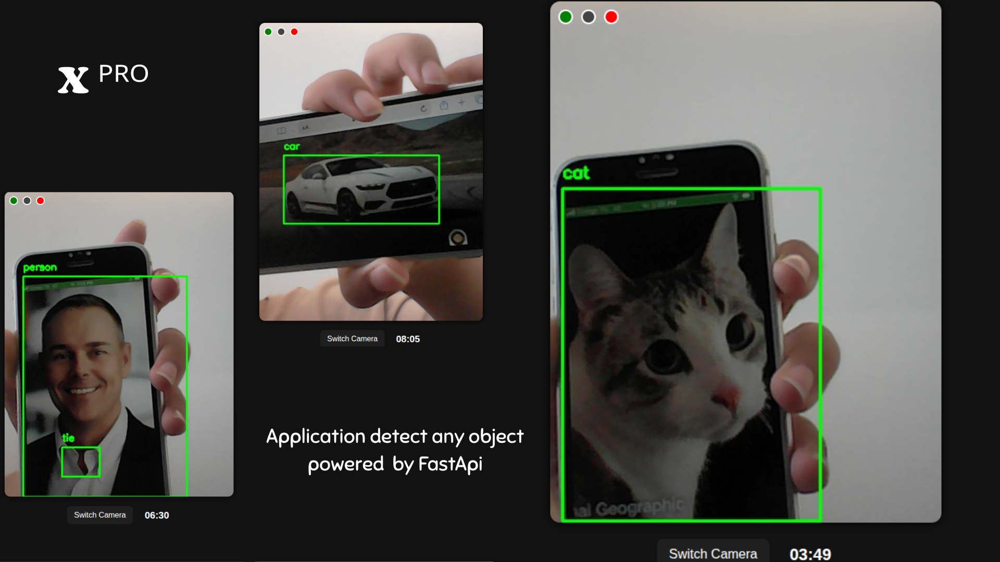

# X ᴾᴿᴼ 
Smart Object Detection & Alert System

**X ᴾᴿᴼ** is a smart  application designed to detect moving objects—such as humans, animals, or vehicles—using the device’s **camera and microphone**. Once a significant movement or sound is detected, it sends **real-time notifications** to the family members’ phones to ensure safety and awareness.

### Run :
 
			 python (or python3) main.py
			 uvicorn main:app --reload

# TEST

